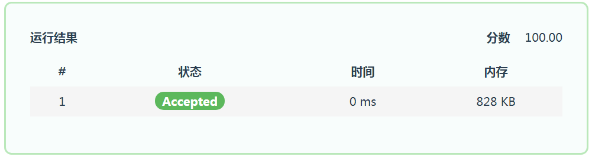

# The Nth Number in Fibonacci Sequence

## 主要思路

根据斐波那契模数列的周期性，先对输入的项数取模并存储于数组中，然后递推得到斐波那契数并输出。

##求项分类讨论

斐波那契数列的第三项及以后均可通过由前两项的数值之和递推得到。而第一二项没有前两项，需要单独输出，于是选择通过if条件句和for循环条件以及对变量x,y的初始化来使x=0和x=1的情况单独输出。

##时间复杂度

时间复杂度为o(n2)