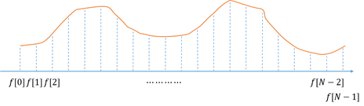
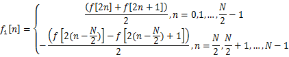
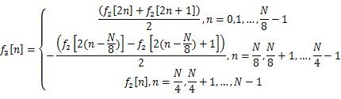
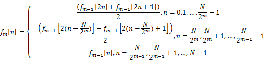

# 小波变换

## 问题描述

小波变换是信号处理中一种常用的信号处理方法。虽然小波变换的理论比较抽象，但是小波变换方法却很容易操作，并且小波变换的程序是可以用递归的方法方便快速的实现。通过这个实验，可以帮助大家了解递归程序的编写与递归方法在实际问题中的应用。

在这个实验中，我们将应用[Haar小波](https://en.wikipedia.org/wiki/Haar_wavelet)来对一个一维的函数进行小波变换。在计算机中，一个一维的函数f(x)可以用一组离散的数值来描述，比如f[0],f[1],...,f[N-1]，如下图所示，这个函数在计算机中可以用一个一维数组来描述。使问题简单化，我们假设N=2L,L=1,2,3,....



最简单的Haar小波变换由下面L次计算获得：>

1. 第1次计算

   

2. 第2次计算

   

3. 第3次计算

   

4. 依次类推，可以得出，第m次计算

   

在上面的计算中，m=1,2,...,L, 即共进行L次运算，既可以得到一个函数的小波变换。下图简单解释了对长度为16的数组进行小波变换的过程


请根据上面的算法，编写小波变换的运算程序，实现对长度为2L的一维数组的小波变换。

## 输入格式

第一行一个正整数即L<=25，信号长度为2^L

第二行2^L个浮点数，用空格隔开，即是待变换信号

## 输出格式

一行2^L个浮点数，用空格隔开表示变换后信号，只要误差在0.001以内都算正确，可以选择保留4位小数。

## 输入样例

``` text
4
1 2 3 4 5 6 7 8 9 10 11 12 13 14 15 16
```

## 输出样例

``` text
8.5000 4.0000 2.0000 2.0000 1.0000 1.0000 1.0000 1.0000 0.5000 0.5000 0.5000 0.5000 0.5000 0.5000 0.5000 0.5000
```

## 提示

本次作业后面的样例L可能较大，采用递归算法时需要考虑到内存的使用多少，否则可能会超出内存限制。
