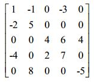

# 稀疏矩阵的存储及操作

## 问题描述

在矩阵中，若数值为0的元素数目远远多于非0元素的数目，并且非0元素分布没有规律时，则称该矩阵为稀疏矩阵。计算机中一般用三元组来表示稀疏矩阵中的非零元素，每个三元组存储的信息为（行数，列数，值），而稀疏矩阵则是由一系列三元组构成的表。



上图中的矩阵即为稀疏矩阵，如果我们用三元组表示这个矩阵，我们可以表示为：{(0,0,1),(0,1,-1),(0,3,-3),(1,0,-2),(1,1,5),(2,2,4),(2,3,6),(2,4,4),(3,0,-4),(3,2,2),(3,3,7),(4,1,8),(4,4,-5)}。

一般而言，我们存储这些三元组有两种方式：

 1. 三元组表：用线性表去串联这些三元组，将二维稀疏矩阵压缩为一维的链表，这种方式可以节省存储空间，但是这样以来我们对矩阵进行操作就变得比较困难了。

 2. 十字链表：为了更快速地实现矩阵各种操作，我们给每个非零元素节点再加两个指针（一个横着方向的，一个竖直方向的），这样的话我们可以既沿着列方向访问该元素，也可以沿着行方向，从而大大提高我们的效率。 这就是十字链表诞生的原因，从这里也可看出十字链表是以单链表为基础的。

本次实验中同学们必须使用以上两种方法的一种实现稀疏矩阵的转置、加法和乘法操作，直面C语言中最困难的指针，希望同学们能够勇敢面对本次实验，相信大家经过本次实验后都能够熟练运用指针。

## 输入格式

输入数据的第一行是三个整数 m, n, l。分别表征矩阵的行数、列数和待输入元素总数。接下来的 l 行, 每一行是三个整数 i, j, v 表示一个矩阵中行号为 i 列号为 j 值为 v 的元素。 <b>m 和 n 的范围是 1000 以内, l 则是 10000 以内。每一个 v 都是在 -10 到 10之间的整数</b>。

注意：这里的行号列号均从0开始，参照题目描述中的样例。

## 输出格式

输出是你打印的三个矩阵, 依次是输入矩阵的转置、输入矩阵和其转置矩阵的和矩阵、输入矩阵和其转置矩阵的乘积矩阵。

为了使答案唯一, 我们规定输出的每一行是矩阵的一个<b>非零元素</b>。顺序是先打印行号小的, 同一行, 先打印列号小的。每一个非零元素需要打印 3 个整数 i,j,v。i 是这个元素行号，j 是这个元素的列号，v 是这个元素的值。 其中 i 和 j 之间打印一个空格，j 和 v之间打印一个空格，v 后是一个换行符号。
 
注意：打印完一个矩阵不需要额外换行。

## 输入样例

``` text
3 3 4 解释: 表示矩阵大小是 3×3, 有 4 个待输入元素, 同时接下来会有 4 行
0 0 1 解释: 坐标是 (0,0) 的位置值为 1
1 1 4 解释: 坐标是 (1,1) 的位置值为 4
0 1 2 解释: 坐标是 (0,1) 的位置值为 2
2 2 3 解释: 坐标是 (2,2) 的位置值为 3
```

## 输出样例

``` text
0 0 1
1 0 2
1 1 4
2 2 3 解释: 到这一行 (包括这一行) 是打印转置矩阵
0 0 2
0 1 2
1 0 2
1 1 8
2 2 6 解释: 到这一行 (包括这一行) 是打印本身与转置的和
0 0 5
0 1 8
1 0 8
1 1 16
2 2 9 解释: 到这一行是打印本身与转置的乘积
```

## 提示

如果想用二维数组通过本次实验是一定不行的哟~

本次实验涉及到的输入输出次数较多，使用scanf和printf能够有效节省时间和内存。

输入的l个三元组是乱序的，注意，由于我们需要计算矩阵的和，所以m和n一定是相等的，其中v的值可能为0。